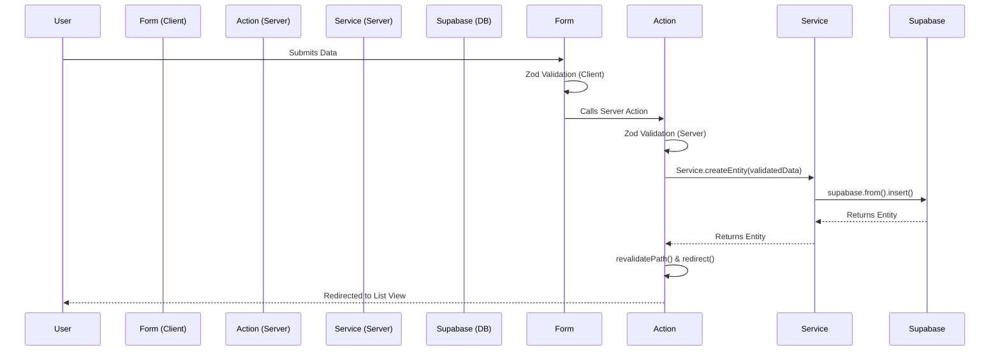

# CRUD Architecture

This document outlines the standard architecture used for all CRUD (Create, Read, Update, Delete) operations within the Rao's Estates admin panel. This architecture ensures separation of concerns, strong typing, and excellent user experience.

## The 4-Layer Architecture

Every feature (Developer, Location, Project) strictly adheres to the following 4-layer architecture:

### 1. The Schema Layer (Zod)
- **Location:** `src/schemas/[entity].schema.ts`
- **Purpose:** Defines the exact shape of the data using Zod.
- **Why:** This schema is used for both client-side form validation (React Hook Form) and server-side validation (Server Actions), ensuring identical validation rules across the stack.

### 2. The Service Layer (Supabase)
- **Location:** `src/services/[entity].service.ts`
- **Purpose:** Contains all direct database interactions using the Supabase client.
- **Rule:** A React Server Component or Client Component should **never** directly import or call the Supabase client for data fetching or mutations. They must always call a method from the Service Layer (e.g., `DeveloperService.getAllDevelopers()`).

### 3. The Action Layer (Next.js Server Actions)
- **Location:** `src/app/admin/(dashboard)/[entity]/actions.ts`
- **Purpose:** Acts as the bridge between the Client Components (forms) and the Service Layer. 
- **Workflow:** 
  1. Receives data from the client form.
  2. Re-validates the data against the Zod schema to prevent malicious bypasses.
  3. Calls the appropriate Service Layer method.
  4. Triggers `revalidatePath()` to clear the Next.js cache and ensure UI updates immediately.
  5. Triggers `redirect()` back to the list view.

### 4. The Presentation Layer (React Components)
- **Location:** `src/app/admin/(dashboard)/[entity]/` and `src/features/[entity]/components/`
- **Purpose:** Renders the UI and manages local state (e.g., form inputs, modals, loading states).
- **Structure:**
  - `page.tsx`: Server Component that fetches initial data via the Service Layer.
  - `[Entity]Client.tsx`: Client Component that handles the Data Table, delete modals, and state.
  - `[Entity]Form.tsx`: Uses `react-hook-form` + `@hookform/resolvers/zod` to handle creation and editing via a unified interface.

## Flow Diagram

