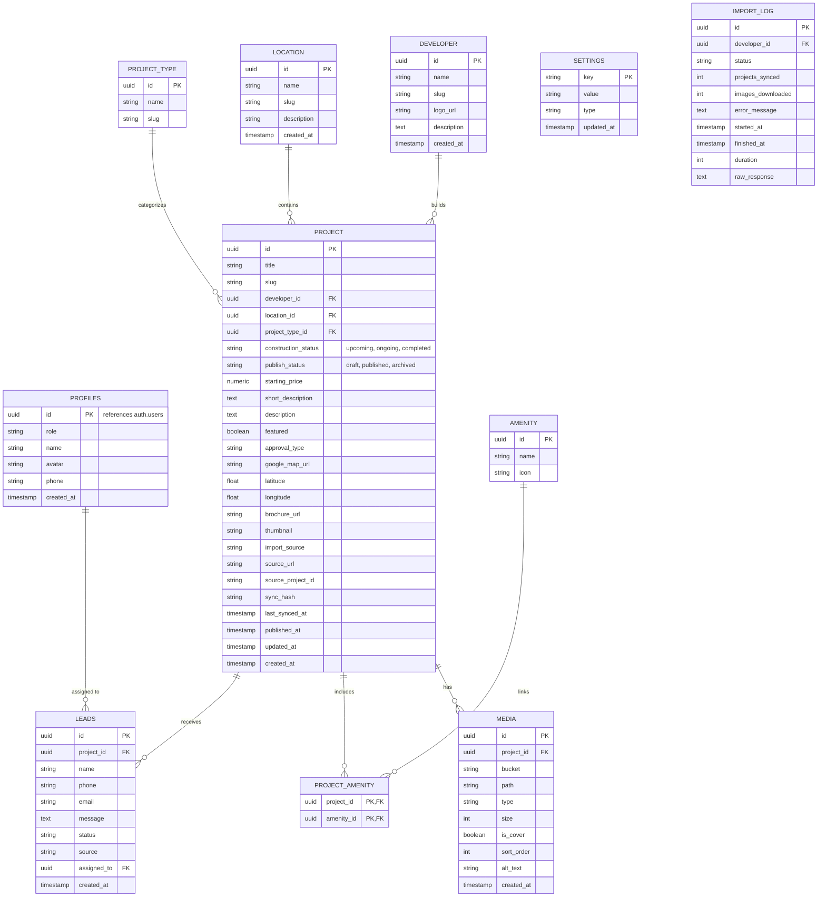

# Database Schema & Storage

This document details the Supabase database schema, storage buckets, and ER Diagram that powers the platform.

## Entity Relationship Diagram (ERD)

## Storage Buckets
The application relies on Supabase Storage for managing assets. We will create the following buckets:
- `projects` - High-resolution images of projects.
- `developers` - Assorted developer assets.
- `brochures` - PDF brochures for projects.
- `logos` - Logos for developers and site branding.
- `testimonials` - Images of happy customers.
- `blog` - Header images for blog posts.
- `avatars` - User profile pictures.

## Key Concepts

### 1. Settings Table
The `settings` table is a flexible Key-Value store. Instead of hardcoding columns like `Phone`, `Hero Title`, or `Footer` on a master table, we store them as individual rows. This allows the admin to dynamically add new configuration values without running database migrations.

### 2. Normalized Amenities
Amenities (e.g., "Black Top Road", "24/7 Security") are stored exactly once in the `amenities` table and linked to projects via the `project_amenities` join table.

### 3. Separation of Project Status
A project's lifecycle is tracked across two distinct states:
1. `construction_status`: The physical state of the project (Upcoming, Ongoing, Completed).
2. `publish_status`: The visibility of the project on the website (Draft, Published, Archived).
This guarantees that a project can be "Ongoing" but remain a "Draft" so it is not prematurely visible to users.

### 4. CRM / Leads
Every contact form submission and WhatsApp enquiry is pushed directly to the `leads` table. This allows the administrative backend to track a customer from `new` to `interested`, `site_visit`, and eventually `closed`.
